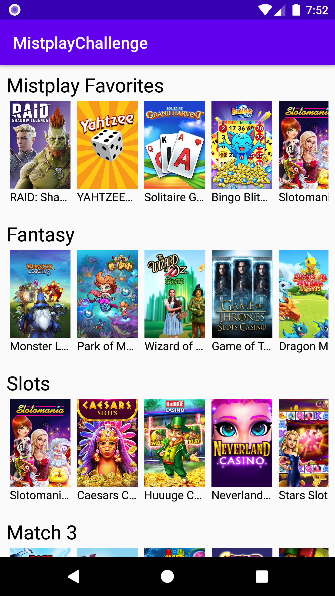

# Mistplay-UI-Challenge

A simple activity with nested recyclerviews. Following were the guidelines:
  - Build the functionality for the list of lists. Make
sure to do this using Object-Oriented programming
principles as well as design patterns.
  - Use the Kotlin programming language
  - Incorporate the classes you build into a sample
application. This sample application can use any design
you choose.
- Well commented and formatted code.

# Extra Features!

  - Added a simple UI/Espresso test to make sure that all categories were being populated in the Verticle/Higher level recyclerview.
  - Technical: Use of Glide library to optimze image loading ability into ImageView
  - Technical: Used databinding to avoid redundant code in some parts of the app (to showcase diversity in implementation). Also it means that Android System only traverses the viwe hierarchy once (to get the views). 
  - Technical: Used layout's that make the UI compatible with screen rotation.  

Future Steps (If I had more time):
  - Instead of hardcoding the list of games (via JSON in txt), I would rather use Retrofit2 to make a REST API call to get the JSON.
  - Implement BDD (Behaviour Driven Development) to better present the UI Automated tests. 
  - Suggestion: Maybe used Material Design suggested "CardView" instead of flat items in the RecyclerView.

### Screenshots:

### Gif:

